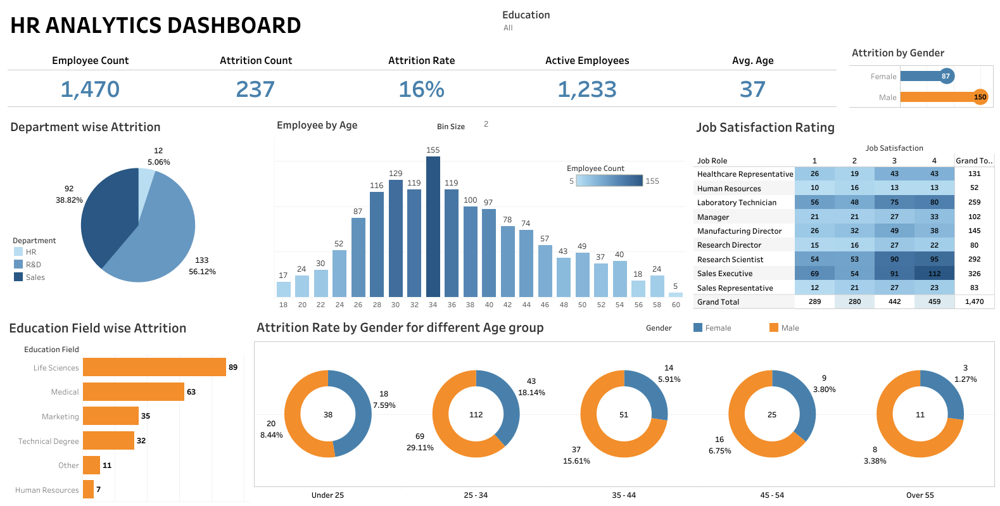

# Proyek Akhir: Menyelesaikan Permasalahan Perusahaan Jaya Jaya Maju

## Business Understanding

Jelaskan latar belakang bisnis dari perushaan tersebut.

### Permasalahan Bisnis

Tuliskan seluruh permasalahan bisnis yang akan diselesaikan.

### Cakupan Proyek

Tuliskan cakupan proyek yang akan dikerjakan.

### Persiapan

Sumber data: ....

Setup environment:

```

```

## Business Dashboard

Link HR Analysis Tableau Public Dashboard : [HR Analysis Dashboard](https://public.tableau.com/app/profile/fauzihan.bagus/viz/HRAnalysis_17457576868510/HRANALYTICSDASHBOARD)




## Conclusion

Berdasarkan analisis data dalam dashboard, ditemukan insight berikut:

1. **Departemen Sales memiliki tingkat attrition tertinggi sebesar 56,12%**.
Hal ini menunjukkan adanya tantangan signifikan dalam mempertahankan karyawan di Sales, kemungkinan disebabkan oleh tekanan target penjualan yang tinggi, persaingan industri yang ketat, atau kurangnya jalur pengembangan karir yang jelas.

### Rekomendasi Action Items (Optional)

Berikan beberapa rekomendasi action items yang harus dilakukan perusahaan guna menyelesaikan permasalahan atau mencapai target mereka.

- Buat program pengembangan karir, mentoring, dan keseimbangan kerja-hidup (work-life balance) yang lebih menarik untuk usia **25-34**.
- Desain program onboarding yang lebih ramah bagi generasi muda dan program pensiun bertahap (phased retirement) untuk karyawan senior.
- Buat program peningkatan kepuasan kerja seperti pelatihan tambahan, perbaikan beban kerja, atau reward system yang lebih baik di role **Sales Executive** dan **Laboratory Technician**.
- Evaluasi kembali kebijakan rekrutmen, program onboarding, dan program retention untuk latar belakang pendidikan **Life Sciences** dan **Medical**.
- Teliti lebih lanjut penyebab spesifik mengapa banyak karyawan pria keluar, misal terkait beban kerja, peluang promosi, atau fleksibilitas kerja.
